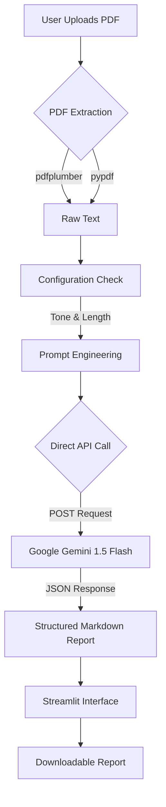

# AVANTI — Research Intelligence Platform

**Live Demo:** [(AVANTI)](https://avanti-research-paper-analyzer2025.streamlit.app/)

---

## Overview

AVANTI is a professional-grade research intelligence platform designed to accelerate academic discovery. It bypasses complex local dependencies by integrating directly with **Google’s Gemini AI API** to provide deep, structural analysis of research papers.

Unlike simple summarization tools, AVANTI generates **structured, high-quality analytical reports** featuring executive summaries, mathematical explanations, critical critiques, and real-world analogies, all presented in a clean, distraction-free interface.

---

## Key Features

### Direct AI Integration
Uses a robust **Direct API mode** to bypass local library conflicts (e.g., `google.generativeai`, `pyparsing`) for improved stability and reliability.

### Professional Deep-Dive Reports
Generates structured analyses including:

- **Executive Summary** — Core motivation and contributions  
- **Technical Mechanics** — Methodology, equations, and algorithmic logic  
- **Critical Critique** — Strengths, weaknesses, and limitations  
- **Key Findings** — Concise, bulleted takeaways  

### Adaptive Professional UI

- **Visual Themes** — System Default, Light Mode, Dark Mode  
- **Clean Design** — Centered, minimal interface optimized for readability  

### Global Research Search

- Integrated **arXiv** search
- Find papers using keywords, titles, or DOI
- Direct access to PDFs and author metadata

### Customizable Analysis Controls

- **Tone Selection** — Professional, Academic, ELi5  
- **Detail Level** — Executive Brief, Standard Report, Comprehensive Deep-Dive  

---

## Quick Start

### 1. Global Search

1. Navigate to the **Global Search** tab  
2. Enter a topic (e.g., *Generative Adversarial Networks*)  
3. Click **Search**  
4. Browse results with links to PDFs and author details  

---

### 2. Deep Document Analysis

1. Navigate to the **Document Analysis** tab  
2. Upload a research paper (PDF)  
3. Open the **Sidebar Configuration** to customize:
   - **Tone** (e.g., Simple / ELi5)
   - **Detail Level** (e.g., Comprehensive Deep-Dive)
4. Click **Generate Analysis Report**
5. Wait for AI processing (approximately 30–60 seconds)
6. Download the final **Markdown report**

---

## Technical Workflow

---

## Function Reference

### install_basics()

Self-healing installer that automatically detects and installs missing dependencies (such as `requests`, `pdfplumber`, etc.) on the first run to prevent runtime crashes.

---

### get_working_model()

Auto-discovery utility that queries the Google API to determine which Gemini model version is available for the provided API key, avoiding model resolution and versioning errors.

---

### analyze_paper_direct(text, tone, length)

Core analysis engine. Sends a carefully engineered prompt to the AI using direct HTTP requests, completely bypassing the unstable Python SDK.

---

### inject_custom_css(theme_mode)

Dynamic styling utility that injects CSS variables to switch between **Light**, **Dark**, and **System** UI themes without reloading the application.

---
## Requirements

Python 3.8+

Google Gemini API Key (environment variable or hardcoded)

Libraries:

-streamlit
-requests
-pdfplumber
-pypdf
-feedparser
